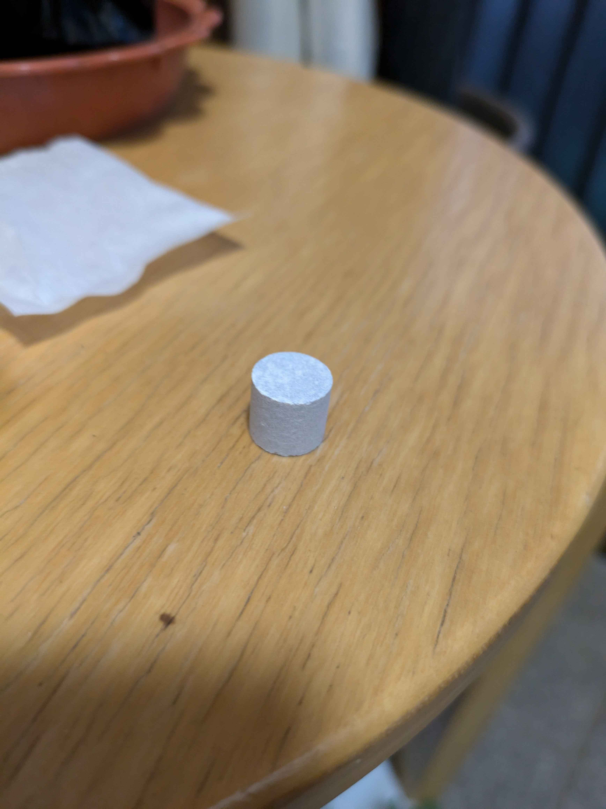
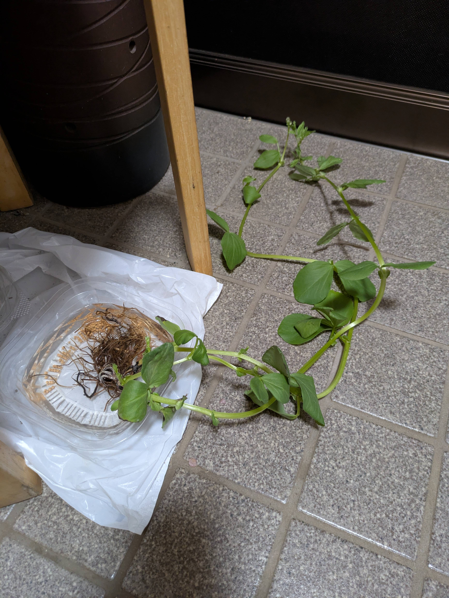

# はじめに
宇宙での栽培を見据えて、ソラマメの水耕栽培にチャレンジしてみました。
水耕栽培の知識がない初心者のため、手探りですが記録を付けています。

# 栽培環境
- 南関東
- 東南東向きの玄関
  - すりガラスから日光が差し込む
  - 特に午前中の日当たりはよい

# 1日目
2025/02/20 17:30 ごろ

根についている土を洗い落とし、水道水に浸し始めました。

# 2日目
2025/02/21 18:00 ごろ

根の周りが少し黒くなったような気がします。

<!--
# 3日目
2025/02/22 21:00 ごろ

特記事項なし。
-->

# 4日目
<!-- 2025/02/23 19:00 ごろ
 -->
下記の商品を購入しました。

- [顆粒HB-101 300g](https://www.hb-101.co.jp/products/detail/145) [^1]
- [日本動物薬品 ニチドウ さんそを出す石 飼育用 1ヶ月タイプ 8個入り](https://www.shopping-charm.jp/product/2c2c2c2c-2c2c-2c2c-2c2c-2c3131363932) [^2]

<!-- 特記事項なし。 -->

# 5日目
<!-- 2025/02/24 18:00 ごろ
 -->

そろそろ栄養剤が必要だろう、ということで、顆粒の栄養剤を水に浸し始めました。

# 6日目
<!-- 2025/02/25 17:30 ごろ
 -->
<!--  -->
<!--  -->
<!--  -->
<!--  -->
<!--  -->
<!--  -->
<!--  -->

顆粒の栄養剤を浸した水 50 ml を5倍に薄めた水溶液 250 ml に、ソラマメの苗を入れ替えました。
さんそが出る石も同時に加えています。

<!-- # 7日目
2025/02/26 19:00 ごろ

# 8日目
2025/02/27 18:00 ごろ

# 9日目
2025/02/28 23:30 ごろ

# 10日目
2025/03/01 23:30 ごろ

# 11日目
2025/03/02 18:30 ごろ

# 12日目
2025/03/03 22:30 ごろ
 -->

# 13日目
<!-- 2025/03/04 18:10 ごろ
 -->
<!--  -->
<!--  -->

水位が低くなっていたことに気が付きました。
8日前（5日目、2025/02/24）に作成した「HB-101 水溶液 100ml + 水道水 50ml = 合計 150ml」を追加しました。

<!-- # 14日目
2025/03/05 23:50 ごろ

# 15日目
2025/03/06 20:30 ごろ

# 16日目
2025/03/07 23:50 ごろ

# 17日目
2025/03/08 23:55 ごろ
 -->

# 18日目
2025/03/09 18:55 ごろ

<!-- 重さを量ってみました
 -->

<!-- 根の一部は変色していないようです。 -->
<!--  -->

1株かと思っていましたが、2株ありそうです。

# 19日目
<!-- 2025/03/10 19:30 ごろ
 -->

<!-- 重量 -->
<!--  -->

水位が低くなっていたので、根が浸かっていた水はすべて捨てました。
14日前（5日目、2025/02/24）に作成した HB-101 水溶液 40ml + 水道水 210ml = 合計 250ml を作成し、そこに株を移動しました。
HB-101 水溶液が無くなったので、顆粒はそのままで新しい水道水 250ml に浸し始めました<!--（2番だし）-->。
<!--  -->

<!-- # 20日目
2025/03/11 23:14 ごろ
 -->

<!-- 重量 -->
<!--  -->

<!-- # 21日目
2025/03/12 18:58 ごろ
 -->

<!-- 重量 -->
<!--  -->

<!-- # 22日目
2025/03/13 20:39 ごろ
 -->

<!-- 重量 -->
<!--  -->

<!-- # 23日目
2025/03/14 21:35 ごろ
 -->

<!-- 重量 -->
<!--  -->

<!-- # 24日目
2025/03/15 18:34 ごろ
 -->

<!-- 重量 -->
<!--  -->

<!-- # 25日目
2025/03/16 18:13 ごろ
 -->

<!-- 重量 -->
<!--  -->

<!-- # 26日目
2025/03/17 21:34 ごろ
 -->

<!-- 重量 -->
<!--  -->

# 27日目
2025/03/18 19:35 ごろ

<!-- 重量 -->
<!--  -->

葉が一部変色していました。

水位も低くなっていたので、8日前（19日目、2025/03/10）に作成した HB-101 水溶液<!--（2番だし）-->の容器に苗を移し替えました。
<!--  -->

<!-- # 28日目
2025/03/19 23:01 ごろ
 -->

<!-- 重量 -->
<!--  -->

<!--
撮影遅れ
# 29日目
2025/03/21 00:16 ごろ

-->

# 30日目
<!-- 2025/03/21 21:27 ごろ
 -->

<!-- 重量 -->
<!--  -->

水位が下がっていたので、水道水道を 200ml 追加しました。

<!-- # 31日目
2025/03/22 19:39 ごろ
 -->

<!-- 葉の変色が気になり、苗にストレスがかかるかもしれないので、重量計測は停止します。 -->

<!-- # 32日目
2025/03/23 23:06 ごろ
 -->

<!--
撮影忘れ
# 33日目
-->

<!-- # 34日目
2025/03/25 23:40 ごろ

# 35日目
2025/03/26 20:03 ごろ

# 36日目
2025/03/27 20:54 ごろ

# 37日目
2025/03/28 23:05 ごろ

# 38日目
2025/03/29 19:10 ごろ

# 39日目
2025/03/30 20:00 ごろ

# 40日目
2025/03/31 22:45 ごろ

# 41日目
2025/04/01 23:59 ごろ
 -->

# 42日目
2025/04/02 23:42 ごろ

気付いたら水がほぼ無くなっていました。
「水道水 300ml + HB-101顆粒 1.5g (1-2cc) + 新しいさんそを出す石」を混合したものに苗を移動させました。

変色してしまった葉を2株合計で9枚摘み取りました。
<!-- （添付画像は同じ葉を撮影したものです） -->
<!--  -->

<!--
ちなみにこちらは、土に植えたまま栽培しているソラマメです。
そろそろ植え替えないと根詰まり？するかもしれません。
水耕栽培の株とは異なり、家族が管理していて、日当たりのよいところに適宜移動させたりしているようです。
-->
<!--  -->
<!--  -->

# 43日目
2025/04/03 21:32 ごろ

前日までは椅子の足に寄りかかる形で上方向にレイアウトできていました。
しかし、前日のメンテナンスで株を移動させたからか、今まで通りのレイアウトが再現できず、諦めて横たわらせています。

<!-- # 44日目
2025/04/04 21:11 ごろ

# 45日目
2025/04/05 23:36 ごろ

# 46日目
2025/04/06 20:40 ごろ

# 47日目
2025/04/07 21:23 ごろ

# 48日目
2025/04/08 21:30 ごろ
 -->

# 49日目
2025/04/09 19:20 ごろ

水位が低くなっていたので、水道水 200ml を追加しました。

# 50日目
2025/04/10 20:31 ごろ

# 51日目
<!-- 2025/04/11 18:41 ごろ
 -->

<!-- 家族が管理している株に蕾がついていました。 -->
<!--  -->

重量を量ってみました。
28.9 g でした。

<!--
# 52日目
2025/04/12 19:40 ごろ

# 53日目
2025/04/13 20:43 ごろ

-->

# 55日目
2025/04/15 20:36 ごろ

小さいですが、蕾が付いていました

<!--
# 56日目
2025/04/16 22:33 ごろ

# 57日目
2025/04/17 22:54 ごろ

-->

# 58日目
<!-- 2025/04/18 21:22 ごろ
 -->
水道水を 300ml 加えました。

<!--
# 59日目
2025/04/20 01:11 ごろ

# 60日目
2025/04/20 20:49 ごろ

# 61日目
2025/04/21 19:55 ごろ

# 62日目
2025/04/22 20:08 ごろ

# 63日目
2025/04/23 19:00 ごろ

-->

# 64日目
2025/04/24 23:41 ごろ

<!--
# 65日目
2025/04/25 23:01 ごろ

# 66日目
2025/04/26 19:12 ごろ

# 67日目
2025/04/27 19:42 ごろ

# 68日目
2025/04/28 18:46 ごろ

# 69日目
2025/04/29 22:12 ごろ

# 70日目
2025/04/30 20:17 ごろ

-->

# 71日目
<!-- 2025/05/01 20:47 ごろ
 -->
水がほぼ無くなっていたので、水道水 300ml を追加しました。

<!--
# 73日目
2025/05/03 19:45 ごろ

-->

# 74日目
2025/05/04 19:45 ごろ

「酸素を出す石x1 + HB-101顆粒2g + 水道水300ml」溶液を新しく用意し、株を移動させました。

<!--  -->
<!--  -->
<!--  -->
<!--  -->

<!--
# 75日目
2025/05/05 20:45 ごろ

# 77日目
2025/05/07 19:00 ごろ

# 78日目
2025/05/08 19:06 ごろ

# 79日目
2025/05/09 19:01 ごろ

# 80日目
2025/05/10 22:15 ごろ

# 81日目
2025/05/11 19:51 ごろ

-->

# 83日目
<!-- 2025/05/13 22:30 ごろ
 -->
水道水 300ml を加えました。

<!--
# 85日目
2025/05/15 20:41 ごろ

-->

# 86日目
2025/05/16 21:33 ごろ

根の近くから茎が分岐して、その先に蕾が付いていました。

<!--
# 87日目
2025/05/17 21:55 ごろ

# 88日目
2025/05/18 19:12 ごろ

# 89日目
2025/05/19 22:23 ごろ

-->

# 90日目
<!-- 2025/05/20 19:41 ごろ
 -->
「HB-101顆粒2g + 水道水300ml」溶液を新しく用意し、株と酸素を出す石を移動させました。

<!-- # 91日目
2025/05/21 19:12 ごろ
 -->
<!--  -->
<!--  -->
<!--  -->

<!--
# 93日目
2025/05/23 19:23 ごろ

# 95日目
2025/05/25 20:49 ごろ

# 96日目
2025/05/26 19:45 ごろ

# 98日目
2025/05/28 21:39 ごろ

# 99日目
2025/05/29 19:07 ごろ

-->

# 100日目
2025/05/30 21:13 ごろ

水道水 300ml を追加しました。
<!--  -->
<!--  -->
<!--  -->
<!--  -->

<!-- # 101日目
2025/05/31 20:49 ごろ
 -->

# 考察
蕾は付いたが、実がならなかった理由として以下の原因が考えられる。

- 肥料不足
- 日照不足
- そもそも水耕栽培に向いていない
  - 根粒菌と共生が難しい

# 終わりに
これからも栽培・観察を続けていこうと思います。
今後は、ミスト栽培に移行する予定です。

俺達の戦いはこれからだ...！

[^1]: https://www.hb-101.co.jp/products/detail/145
[^2]: https://www.shopping-charm.jp/product/2c2c2c2c-2c2c-2c2c-2c2c-2c3131363932
